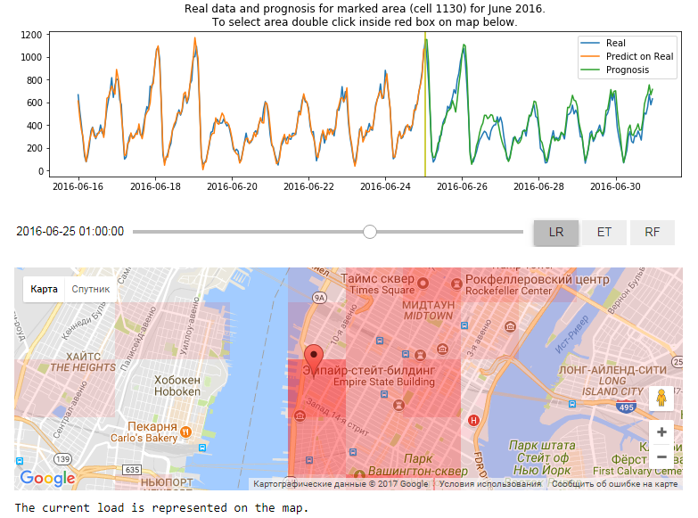

**Введение**

Это финальное задание курса "Машинное обучение и анализ данных" от МФТИ и Яндекс на Coursera.

Финальное задание я представляю в виде интерактивного ноутбука (в [данном](https://github.com/AntonOvsyannikov/week7_final_AO_py3) репозитории находится версия для Pyhton 3.6), который можно [Запустить в Binder](https://mybinder.org/v2/gh/AntonOvsyannikov/week7_final_AO_py3/master?filepath=yellow_taxi_week7_py3.ipynb)

Просто щелкните по [ссылке](https://mybinder.org/v2/gh/AntonOvsyannikov/week7_final_AO_py3/master?filepath=yellow_taxi_week7_py3.ipynb) и подождите загрузки сервера. Дальнейшие инструкции находятся в ноутбуке.

Версия для Python 2.7 находится [в этом репозитории](https://github.com/AntonOvsyannikov/week7_final)

Для тех, кому по какой либо не удалось запустить программу в Binder рекомендуется скачать и распаковать [архив с ноутбуком и минимальным набором данных для Python 2.7](https://github.com/AntonOvsyannikov/week7_final/raw/master/week7_final_AO.zip), после чего открыть и запустить ноутбук в Jupyter.

**Описание**

В данной программе мы делаем прогноз на Июнь 2016 года при помощи модели, обученной на данных до мая 2016 (включительно). При этом используется простейшая авторегрессионная модель на большом числе отстчетов в прошлое (500), которая в моих экспериментах показала наилучшие результаты. Обучения и предсказания делаются индивидуально для каждого ряда. Использование при этом внешних признаков (погода, выходные дни, гармоники) особенной целесообразности не показало (функции для генерации оставлены во включаемом модуле).

**Как пользоваться**

Путем двойного щелчка на карте можно установить маркер в интересующей части города. При этом автоматически определится номер ячейки и на графике будет отображен ряд, соответстующий количеству поездок из выбранной области.

С помощью слайдера можно выбрать дату и время. При этом на карте отобразится соответствующий моменту спрос на такси по всему городу. Интересно наблюдать, как смещается спрос утром-вечером и выходные-будние дни, легко определить место концентрации злачных заведений, при этом профиль количества поездок из таких ячеек так же имеет очень характерную форму.

Также на графике отображаются результаты прогнозирования. При этом слева от вертикальной линии прогноз будет рассчитан с использованием только реальных данных (т.е. мы увидим, насколько хорошо авторегресиионная модель описывает имеющиеся данные), а справа будет дан прогноз в будущее. Перемещая слайдер можно наглядно наблюдать как меняется прогноз справа по мере поступления в модель новых реальных данных. 

С помощью кнопок можно выбрать регрессор, используемый в авторегрессионной модели и пронаблюдать как изменяются прогнозы. Предупреждение: все регрессоры, за исключением первого (Linear) требуют ощутимого времени на настройку. На время, пока модель настраивается над графиком отображается надпись "Please wait..."

**Скриншот**

Так выглядит программа (для тех, кому не удалось запустить ноутбук)

